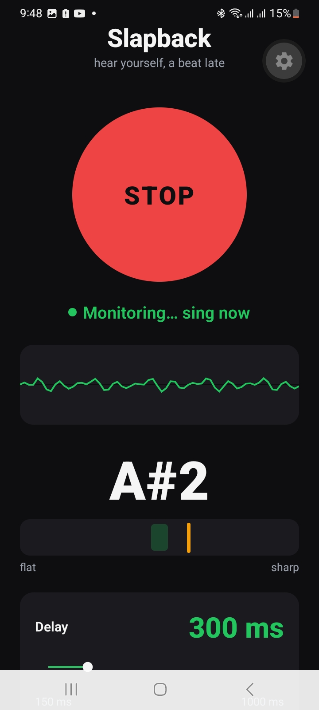

# Slapback

**A live delayed vocal monitor for singers.**

Slapback feeds your microphone back through your earbuds with a short,
adjustable delay (150–1000 ms). Hearing yourself a beat behind makes it far
easier to lock in pitch and timing while you sing — you finish a phrase, hear it
land a moment later, and correct on the fly.

It's the same effect as the slight delay when you call your own number, but
tuned deliberately and controllable in real time — plus a live tuner so you can
*see* your pitch while you correct it.

<p align="center">
  
</p>

---

## What it does

- Continuous **mic → delay → earbuds** monitoring while the button is on.
- A **delay slider** you can move while singing (150 ms to 1000 ms).
- A **live waveform** and a **tuner** — see the note you're singing and how
  sharp or flat you are, in real time.
- An **echo-cancellation toggle** for speaker use.
- One screen. No accounts, no network, no nonsense.

---

## Requirements

- An **Android phone**.
- **Wired or low-latency earbuds strongly recommended.** With earbuds the
  speaker can't feed back into the mic, so you get clean sound and no howl.

---

## Install (the easy way)

1. Download the latest `slapback.apk` from the
   [Releases](../../releases) page.
2. On your phone, open the file. If prompted, allow
   *Install unknown apps* for your browser or file manager.
3. Tap **Install**, then open Slapback.
4. Plug in earbuds, press **START**, and sing.

---

## Usage

1. Put in your earbuds.
2. Press the big **START** button.
3. Set the **Delay** slider to taste — start around 300 ms.
4. Sing. You'll hear yourself a beat late; adjust your pitch and timing to it.
5. Leave **Echo Cancellation** off when using earbuds for the cleanest sound.
   Turn it on only if you're using the phone's loudspeaker.

---

## Build from source

You'll need [Node.js](https://nodejs.org), the
[Expo CLI](https://docs.expo.dev), and a free
[Expo account](https://expo.dev) for cloud builds.

```bash
# 1. Get the dependencies
npm install

# 2. (One time) build a development client APK and install it on your phone
eas build --profile development --platform android
#    install the resulting APK, then start the live-reload dev server:
npx expo start --dev-client

# 3. Build a shareable standalone APK
eas build --profile preview --platform android
#    EAS returns a download link to slapback.apk — sideload it onto any phone.
```

> This app uses native audio, so it does **not** run in Expo Go. Use a
> development build or the standalone APK above.

---

## How it works

The signal path is dead simple:

```
microphone → delay buffer → earbuds / speaker
            └→ analyser → pitch detector → note + tuner
```

A read-only "tap" on the live mic feeds a pitch detector that runs ~10 times a
second: it finds the repeating period of your voice, converts it to a note and
how sharp/flat you are, and drives the on-screen waveform and tuner — without
touching the sound you hear.

The code is split into clear layers — the screen, small control hooks, and
single boundary modules that are the only things touching the mic or the
detector. See [`docs/CONTEXT.md`](docs/CONTEXT.md) for the full architecture.

Built with [Expo](https://expo.dev) and
[react-native-audio-api](https://github.com/software-mansion/react-native-audio-api).

---

## Built in the open — live, AI-assisted debugging

This app was built and debugged **live on a real phone**, with the app streaming
its own analysis to a log that could be read in real time. When the tuner wouldn't
lock onto a note, nothing was guessed — the app logged the actual numbers coming
off the mic, ~10 times a second, and the fix followed straight from the data:

```
LOG  [pitch] t=15  level=0.009  rawHz=null    note=-      ← silence, nothing to detect
LOG  [pitch] t=30  level=0.610  rawHz=116.5   note=A#2    ← singing — locked on
LOG  [pitch] t=45  level=0.715  rawHz=117.1   note=A#2
```

Your voice becomes three numbers — a loudness, a frequency, and a note — many
times a second. Watching the *real values* (not assumptions) is what turned a
vague "it's frozen" into a precise, one-line fix. The full live-reload +
log-driven method is written up in
[`docs/DEV_WORKFLOW.md`](docs/DEV_WORKFLOW.md).

---

## License

MIT — see [LICENSE](LICENSE).
